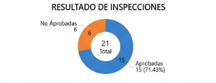
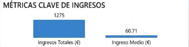
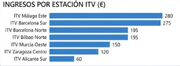
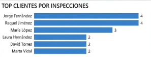
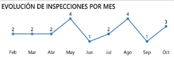
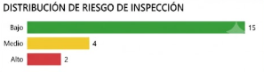

# 🚗 ITV Inspection Analytics - Data Warehouse Project

## 📌 Overview

Este proyecto simula un sistema de análisis de inspecciones ITV utilizando un modelo de datos tipo **Data Warehouse (Star Schema)**.

El objetivo es analizar el rendimiento de estaciones ITV, vehículos, inspectores y tendencias temporales mediante SQL avanzado.

---

## 🎯 Objetivos del proyecto

- Diseñar un modelo dimensional (estrella)
- Simular datos realistas de inspecciones ITV
- Aplicar técnicas de limpieza y calidad de datos
- Realizar análisis exploratorio (EDA en SQL)
- Generar KPIs y métricas de negocio
- Utilizar SQL avanzado (CTEs, joins, window functions, etc.)

---

## 🧱 Estructura de la base de datos

El modelo está compuesto por:

### 🔷 Fact Table
- fact_inspecciones

### 🔷 Dimension Tables
- dim_clientes
- dim_vehiculos
- dim_estaciones
- dim_inspectores
- dim_fechas

---

##  Estructura del proyecto

```bash

itv-inspection-analytics/
│
├── README.md
│
├── model/
│   ├── model.png
│   └── model_explanation.md
│
├── sql/
├── 01_schema.sql
├── 02_data.sql
├── 03_eda.sql
│
├── data/
│   └── sample_data_notes.md
│
└── docs/
    └── business_rules.md
    │__ graph/
```
---

## 📊 KPIs e Insights Clave

---

### 1. Tasa de aprobación global



 **Insight:**  

La tasa de aprobación del sistema ITV es del 71,43%, con 15 inspecciones aptas de un total de 21 realizadas.

Este resultado indica que aproximadamente 7 de cada 10 vehículos superan la inspección en el primer intento, mientras que el 28,57% restante presenta defectos que requieren una nueva revisión o una reparación previa.

Desde el punto de vista del negocio, este porcentaje refleja un nivel de cumplimiento elevado, aunque sigue existiendo un volumen relevante de inspecciones no aptas que generan segundas revisiones y, por tanto, actividad e ingresos adicionales para las estaciones ITV.

---

### 2. Ingresos totales y promedio por inspección



 **Insight:**  

Las 21 inspecciones realizadas han generado unos ingresos totales de 1.275 €, con un ingreso medio de 60,71 € por inspección.

El importe medio se mantiene bastante estable, lo que indica una política de precios homogénea entre las diferentes revisiones realizadas. Además, el volumen de ingresos está impulsado tanto por las inspecciones iniciales como por las segundas revisiones derivadas de resultados desfavorables o negativos, aumentando la rentabilidad del servicio sin necesidad de captar nuevos clientes.


---

### 3. Rendimiento por estaciones ITV
 

**Insight:**  

La estación ITV Barcelona Sur destaca como el centro con mejor rendimiento del conjunto, acumulando 5 inspecciones y alcanzando una tasa de aprobación del 100%, lo que refleja una alta eficacia operativa y un parque de vehículos en buen estado. 

Por otro lado, ITV Málaga Este presenta el mayor ingreso medio por inspección (70 €), mientras que estaciones como ITV Barcelona Norte, ITV Bilbao Norte e ITV Murcia Oeste muestran una mayor presencia de inspecciones con incidencias, ya que únicamente una de cada tres revisiones finaliza con resultado favorable.

---

### 4. Top clientes por número de inspecciones
 

**Insight:**  

Jorge Fernández y Raquel Jiménez son los clientes más recurrentes del sistema, con 4 inspecciones cada uno, lo que refleja un seguimiento periódico de sus vehículos y una alta fidelidad al servicio ITV. 

Además, la presencia de varios clientes con más de una inspección confirma que el conjunto de datos simula adecuadamente situaciones reales, incluyendo revisiones periódicas, segundas inspecciones tras resultados desfavorables y mantenimiento continuado del vehículo a lo largo del tiempo.

---

### 5. Evolución de inspecciones por mes


**Insight:**  

El volumen de inspecciones se concentra principalmente en los meses centrales del año (mayo, agosto y octubre), lo que sugiere una estacionalidad clara en la actividad ITV.


---

### 6. Distribución del nivel de riesgo


**Insight:** 

La mayor parte de las inspecciones se concentran en el nivel de riesgo BAJO (15 casos), lo que confirma que el parque de vehículos analizado presenta un estado general adecuado y con pocos defectos graves.

No obstante, existen 4 inspecciones en riesgo MEDIO y 2 en riesgo ALTO, lo que representa aproximadamente un 28% del total de inspecciones con algún grado de riesgo relevante. Esto sugiere que, aunque la situación global es positiva, hay un volumen no despreciable de vehículos que requieren seguimiento o intervención para evitar que evolucionen hacia fallos más graves.

---

## 🛠 Tecnologías Utilizadas

- SQL (MySQL, Workbench)
- Modelado de datos (Esquema en estrella)
- Conceptos ETL (limpieza y transformación de datos)
- SQL analítico (CTEs, funciones ventana, subconsultas)

---

## 📈 Aprendizajes del Proyecto

Este proyecto demuestra la capacidad de:

- Diseñar e implementar un Data Warehouse relacional
- Diseñar e implementar un Data Base relacional
- Trabajar con datos reales simulados con errores y nulos
- Construir consultas analíticas orientadas a negocio
- Transformar datos en insights accionables

---

## 🚀 Conclusión

Este proyecto simula un entorno real de análisis de inspecciones ITV, permitiendo transformar datos operacionales en información estratégica.

A través del modelo en estrella y el análisis SQL, se identifican patrones clave de rendimiento, riesgo y eficiencia operativa, demostrando el potencial del análisis de datos para la toma de decisiones en sistemas industriales y administrativos.

## 👨‍💻 Autor

Adrián Potenciano  
Proyecto de SQL y Análisis de Datos

